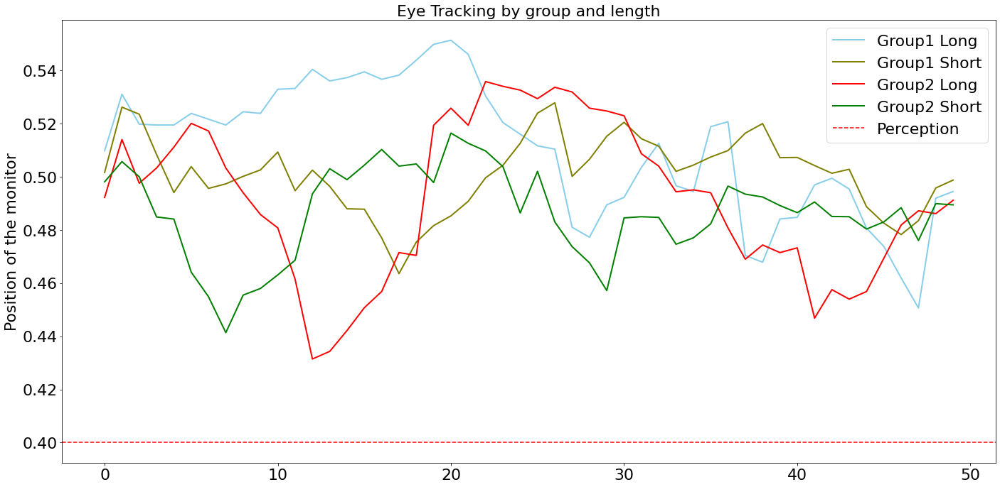
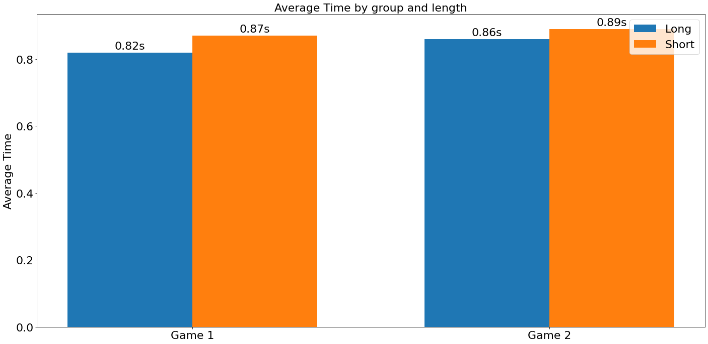
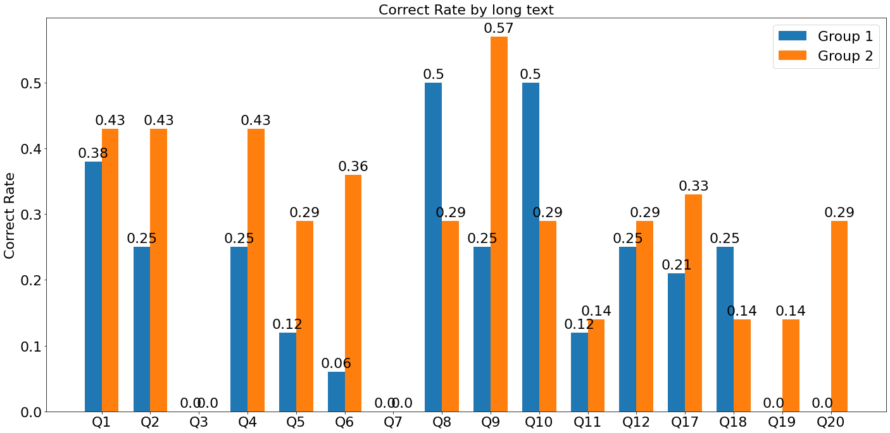
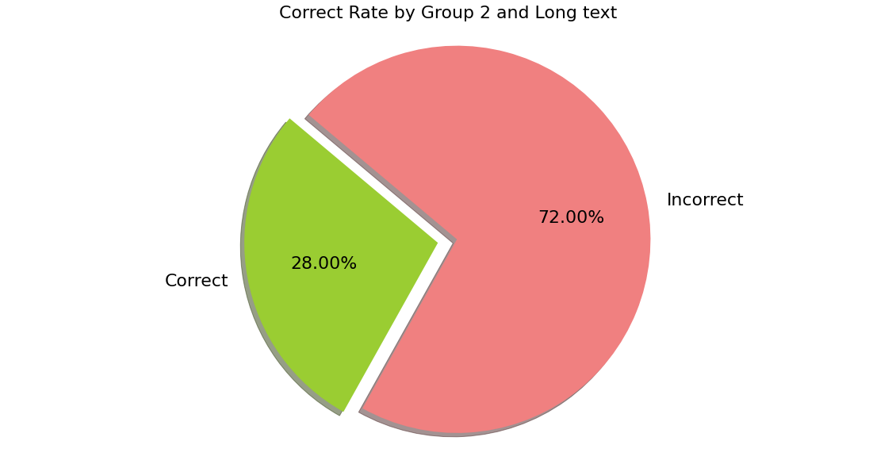
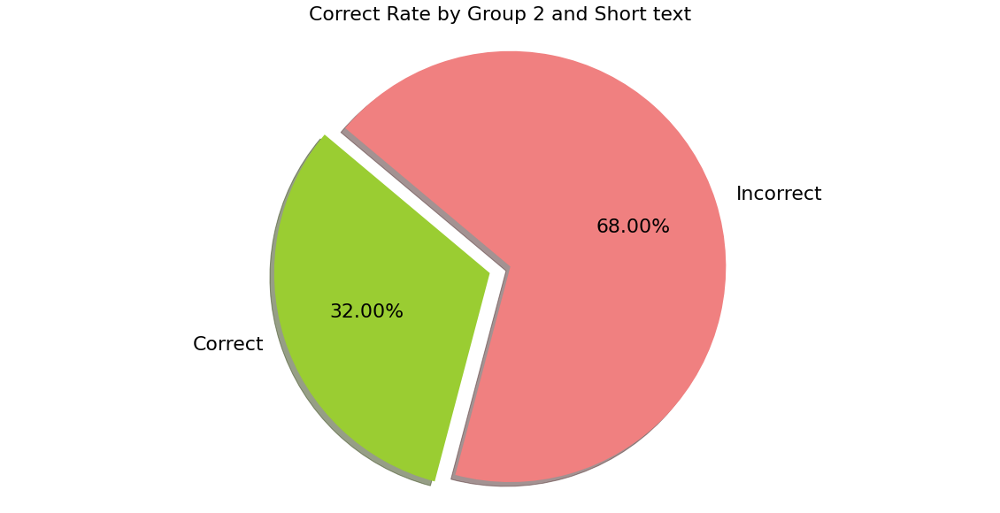

# Information Awareness VS Multitasking Study

## Introduction

The aim of this project is to study the relationship between information awareness and multitasking. 
We assume that the chunking and frequency of the information will impact information awareness when people are doing a continous attention task. In this study, participants will be asked to play the link-up game (continous attention task) while having some long or short pop-up notifications (different chunking and frequency of information) during the game. The notifications will pop up with temporal density consistent. After the game, participants will take questionnaires to test information awareness.
<br><br>
The game starts by recognizing the face of the participants in order to track their eye gaze data. And the game starts by clicking the “Start Game” button. There are two “Start Game” buttons, each has a different but complementary permutation of the notifications to reduce the bias. The game rule is to identify and click the two tiles with the same image and can be reached within two orthogonal turnings. After doing so, the corresponding tiles will be removed. When all tiles are eliminated, the level is completed. Meanwhile, the long texting notifications will occur every 30 second, and short texting notifications would occur four times per 30 sechond. The game duration is 11 minutes, in the end, the participants will be redirected to the questionnaire page.

### Research Question
How does chunking and frequency of information impact information awareness, under the presence of a continuous attention task. 

### Demo
To execute or demo this project, please access the URL: https://multifun.iceloof.com

Supported System: Windows, Mac, Android

Supported Browser: Chrome 


 Eye tracking demostration 

 

 Link game with short notification pop-up


 Link game with long notification pop-up


## Summary

  - [Getting Started](#getting-started)
  - [Built With](#built-with)
  - [Functionality](#functionality)
  - [Experiment](#experiment)
  - [Data Analysis](#data-analysis)
  - [Authors](#authors)
  - [License](#license)
  - [Acknowledgments](#acknowledgments)

## Getting Started

These instructions will get you a copy of the project up and running on
your local machine for development and testing purposes. See deployment
for notes on how to deploy the project on a live system.

Before starting the game, participants need to be asked to turn on the camera and obtain camera permissions. This part of our eyeball recognition can track the movement of the user's eyeballs to get the user's focus. After obtaining the permission, the user can start the game by clicking the start button. When the user cannot find the same icon to connect, click the help button to help eliminate it.

### Prerequisites

System Requirements (Mac & Linux, Windows)

To set up a development environment, please check the following software and environment have been installed. Refer to the [**Installing**](#Installing) section to set up a new environment.

    Git, Google Chrome, Python3, Jupyter, numpy, pandas, matplotlib
    
**IMPORTANT:** Since the experiment is highly depending on the eye-tracking techniques, therefore a computer with a valid camera for video chat is **required**. Usually a laptop is fine.

## Installing

As the project could be divided into two main parts: _Implementation_ and 
_Data Analysis_. These parts are introduced under separate sections.

### Implementation
To set up the project on your own device, you would need to follow the following steps:

**For Mac & Linux User:**
```
# STEP 1
Open your terminal

# STEP 2
cd ~/Documents

# STEP 3
git clone https://github.com/COMPSCI705-SOFTENG702-Group-2/LinkupGameWithNotifications.git

# STEP 4
Open the frontend directory (in the path ~/Documents/LinkupGameWithNotifications)
(example path: /Users/siyuqian/Documents/LinkupGameWithNotifications/frontend)

# STEP 5
Double click on the index.html (For the presistency of the program behaviour we recommend you to use Google chrome)
```

**For Windows User:**
```
# STEP 1
Click Download ZIP button in the homepage of the repository (The screenshot are provided below)

# STEP 2
Extract the ZIP file

# STEP 3
Double click on the index.html (For the presistency of the program behaviour we recommend you to use Google chrome)
```


### Data Analyse
A step by step series of examples that tell you how to get a development
env running.

Analyser tool:

  - Download and install Python3 from https://www.python.org/downloads/
  - Install packages <code>pip install jupyter numpy pandas matplotlib</code>
  - Go to "Analyser" folder, <code>jupyter notebook --port 8888</code> and open http://localhost:8888/ to start the analyser program

Experiment Environment setup:

  - Put everything under "frontend" folder into web server(Apache or Nginx), and then go to the browser to visit it.

## Built With

  - [Linkup](https://github.com/gd4Ark/linkup) - The primary code base that we used to build the Linkup game. The game is treated as the main task that requires continuous attention. 
  - [Eye Tracking](https://github.com/brownhci/WebGazer) - The open-source library that we used for gathering eye-tracking data. In this experiment, we are interested in the duration and frequency that the participants look at the notifications.

## Experiment

### Introduction

  The purpose of the experiment is to test users’ information awareness when they are doing a continuous attention task. We assume that the chunking and frequency of the information will impact users’ information awareness.

  The link game will be used as the continuous attention task in this experiment. Because the link game is a popular game with simple execution, and the complexity of it will be similar to all the participants. It could be instead of any continuous attention task like driving or writing, etc.

  To test the information awareness, we use the texting notifications which will pop up and interrupt participants when they play the game. We will use eye tracking to track their behavior when the notification pops up and will use questionnairos to test the accuracy of the information awareness. All those data will be help us to identify the information awareness.

  There are 2 types of notification, long texting notification, and short texting notification. The long texting notification includes 4 sentences and the short one includes 1 sentence. To make sure the participants will receive the same volume of information with temporal density consistent. The long texting notification will pop up with the 4 short texting notifications at the same time duration (30s). The purpose of this design is to make sure that the short texting message that could present the chunking and frequency of the differs from the long texting message.
  
  In order to reduce the confounding variables of long or short texting notification order. The experiment will provide 2 different orders of the notifications. The first order is: long, short, long, short, long, short, long, short. The second order is: short, long, short, long, short, long, short, long.

Refer to the [Participant Information Sheet](https://github.com/COMPSCI705-SOFTENG702-Group-2/LinkupGameWithNotifications/blob/master/docs/COMPSCI705_PIS_Students_Oct_2020.pdf) and [Consent Form](https://github.com/COMPSCI705-SOFTENG702-Group-2/LinkupGameWithNotifications/blob/master/docs/Consent_Form.pdf).

### Approach
Within-subject
### Participants
10 university students
### Duration
Around 15 minutes (including game and questionnaires)

### Steps:
  1. Explain the experiment and game rules  
  2. Participants read the Participant Information Sheet and sign the Consent Form
  3. Randomly separate participants into two groups (Group A, Group B)
  4. Group A will execute the Game 1, Group B will execute the Game 2 (the difference between Game 1 and Game 2 is the order of notification )
  5. Adjust the eye tracking with the webcam in the laptop
  6. Participants will start the game 1 or 2
  7. Ask participants to keep playing the game as fast and accurately as possible, and take a look at all the notifications
  8. When they start the game, the notifications will pop up after 30 seconds
  9. Participants will jump into a survey after the experiment
  10. Participants will need to fill up the questionnaires
  11. Complete the experiment 

## Data Analysis
We collected gaming data, eye tracking data, manual dismiss notification and survey data through Google Form, and the data is exported as csv under "Analyser" folder. Based on the data analyser tool "Analyser/analyser.ipynb", there are some data which are not useful for our analysis, like the gaming data, which is very hard to link to the survey data, and the manual dismiss notification data shows nobody close the notification manually, so there are not used in this analysis. 

You can check the program <a href="https://github.com/COMPSCI705-SOFTENG702-Group-2/LinkupGameWithNotifications/blob/master/Analyser/analyser.ipynb" target="_blank">here</a>(ipynb) or <a href="https://github.com/COMPSCI705-SOFTENG702-Group-2/LinkupGameWithNotifications/blob/master/Analyser/analyser.pdf" target="_blank">here</a>(pdf).

These are the charts we generated from the eye tracking and survey data:
  - There are 20*50 data collected from each participant, it represents 20 notifications with 50 data points for each, 50 data points are collected within 5 seconds. We calculated average value for each data point and draw with line chart to see how participants eye moving pattern during the notification popup.
  


Position of the monitor - The eye tracking data for each participant is a 20*50 array, each data point represent participant's eye focus on the proportion of the screen, 0.1 means looking at the top 10% of the screen, 0.4 means looking at the top 40% of the screen, etc.

  - We set a threshold 0.4 to check whether the participant was looking the notification or not. As 50 data points were collected in 5 seconds, the average time can be counted as the number of value less or equal to 0.4 divides 50 and times 5.
  


  - Besides eye tracking data, we also analyse survey answers by group and length, the survey includes single choice and multiple choice, so the average correct rate will be calculated by true or false or the percentage of the correct answer for each question. 
  



  - To have a better sense of our result, we also draw pie charts to show the correct rate by group and different text length with all data.
  



## Authors

  - Researchers: Annie Xu, Bruce Gao, Siyu Qian, Hurin Hu, Zach Wang
  - Supervisor: Dr. Danielle Lottridge 

## License

This project is licensed under the [CC0 1.0 Universal](LICENSE.md)
Creative Commons License - see the [LICENSE.md](LICENSE.md) file for
details

## Acknowledgment
This project was conducted supported by Dr Danielle Lottridge of the Department of Computer Science at
the University of Auckland.
